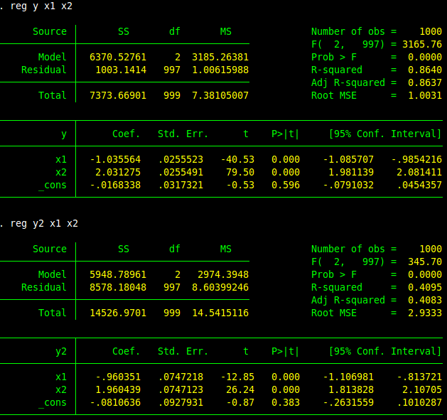

#R-Square 

###R square only how much variance you have found. 
$$$sdfsadf$$$

*For example*

There are two regression analysis here, we generate them with same coefficients, the only difference is the error has different variance. 


```
set obs 1000  gen z=rnormal(0,1)
gen z2=rnormal(0,1)

gen x1=z+z2

gen x2=z2+rnormal(0,1)
gen y=-1*x1+2*x2+rnormal(0,1)
gen y2=-1*x1+2*x2+3*rnormal(0,1)
reg y x1 x2
reg y2 x1 x2
gen yp=y-3*x1
reg y x1 x2
reg yp x1 x2
reg y x1
ivregress 2sls y (x1=z)
```


The R-square for first model is **0.86** but the second model is only **0.40**, even though they have the same model when we build them. So the R square only tell us how much variance we have caught, only how we explain the model. Here the Variance of error will be something determine the R-square as well.
